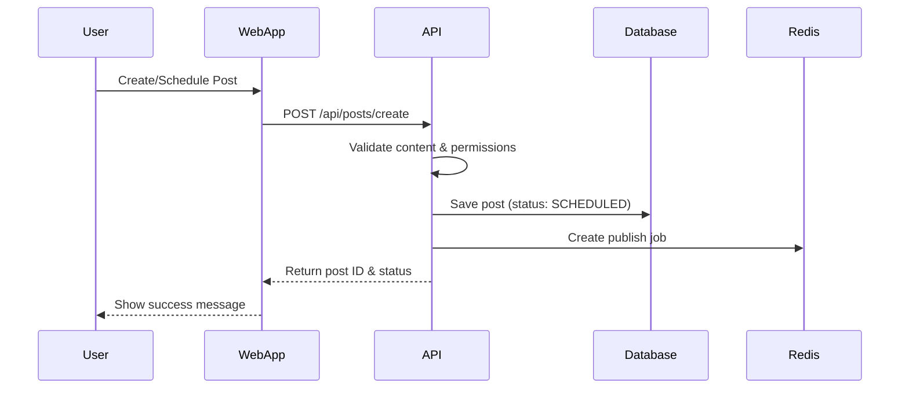
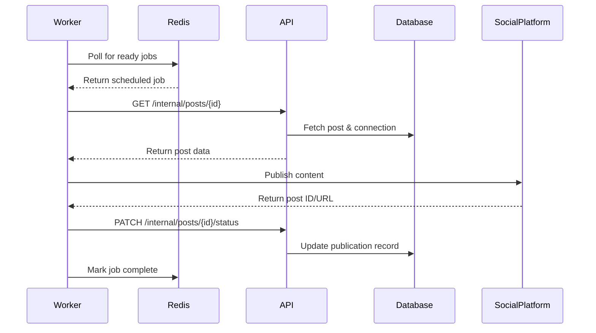
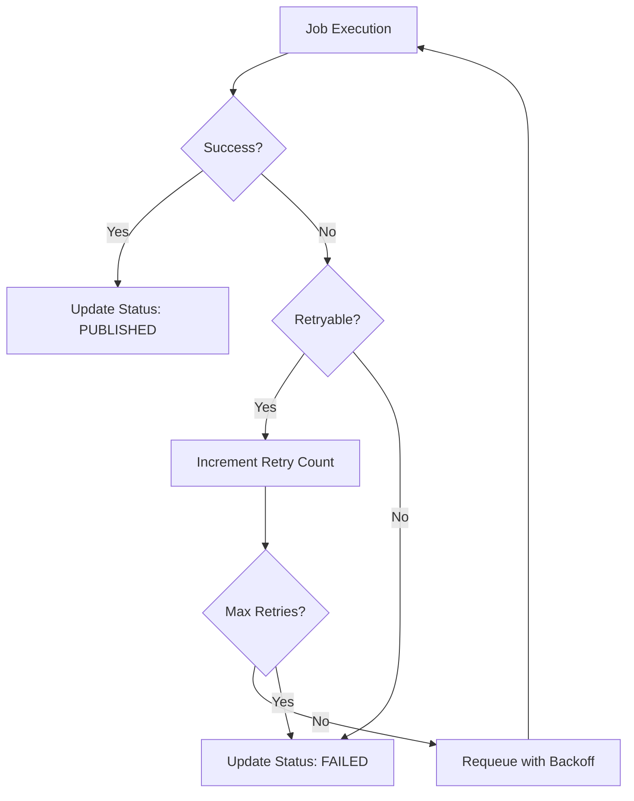

# Architecture & Workflow Documentation

## System Architecture Overview

The planrrr.io platform consists of three main services that work together to enable social media scheduling and publishing:

```
┌─────────────┐     ┌─────────────┐     ┌─────────────┐
│   Web App   │────▶│     API     │◀────│   Worker    │
│  (Next.js)  │     │   (Hono)    │     │  (BullMQ)   │
└─────────────┘     └─────────────┘     └─────────────┘
       │                    │                    │
       └────────────────────┼────────────────────┘
                            ▼
                    ┌─────────────┐
                    │  PostgreSQL │
                    │   (Neon)    │
                    └─────────────┘
                            ▲
                            │
                    ┌─────────────┐
                    │    Redis    │
                    │  (Upstash)  │
                    └─────────────┘
```

## Service Responsibilities

### Web App (Next.js)
- **Purpose**: User interface for content creation and management
- **Deployment**: Vercel
- **Key Features**:
  - User authentication (Better Auth)
  - Content creation and editing
  - Schedule management
  - Analytics dashboard
  - Team collaboration

### API Service (Hono)
- **Purpose**: Central business logic and data management
- **Deployment**: Vercel Edge Functions
- **Key Features**:
  - ORPC endpoints for type-safe communication
  - Database operations via Prisma
  - Authentication and authorization
  - Job scheduling in Redis queue
  - Webhook handling for social platforms

### Worker Service (BullMQ)
- **Purpose**: Background job processing for scheduled posts
- **Deployment**: Railway
- **Key Features**:
  - Queue processing with BullMQ
  - Social media API integrations
  - Retry logic with circuit breakers
  - Media upload handling
  - Status synchronization

## Core Workflows

### 1. Content Creation & Scheduling Flow



**Steps**:
1. User creates content in the web interface
2. Web app sends post data to API via ORPC
3. API validates the request and user permissions
4. Post is saved to PostgreSQL with `SCHEDULED` status
5. Job is queued in Redis with scheduled time
6. Success response returned to user

### 2. Publishing Execution Flow



**Steps**:
1. Worker continuously polls Redis for jobs ready to execute
2. When scheduled time arrives, worker picks up the job
3. Worker requests full post details from API
4. Worker publishes to social platform using stored credentials
5. Platform returns the published post ID/URL
6. Worker updates post status via API
7. Job marked as complete in queue

### 3. Error Handling & Retry Flow



## Current Implementation Status

### ✅ Completed Components

#### Worker Service
- [x] Publisher implementations (Facebook, Instagram, X, YouTube)
- [x] Queue processor with BullMQ
- [x] Circuit breaker for fault tolerance
- [x] Retry logic with exponential backoff
- [x] Comprehensive test suite
- [x] Monitoring and logging setup

#### Database Layer
- [x] Complete Prisma schema
- [x] Models for User, Team, Post, Connection, Publication
- [x] Indexes for performance optimization
- [x] Audit fields (createdAt, updatedAt)

#### Infrastructure
- [x] Monorepo setup with Turborepo
- [x] TypeScript configuration
- [x] Environment variable management
- [x] CI/CD pipeline setup

### 🚧 In Progress / Needed

#### API Service
- [ ] ORPC procedure implementations
- [ ] Authentication middleware
- [ ] Rate limiting
- [ ] Internal API endpoints for worker
- [ ] Webhook handlers for OAuth flows

#### Web Application
- [ ] Authentication pages
- [ ] Dashboard components
- [ ] Post composer interface
- [ ] Schedule calendar view
- [ ] Analytics dashboards

#### Integration Points
- [ ] Worker ↔ API communication
- [ ] OAuth flow implementation
- [ ] Webhook processing
- [ ] Real-time updates (WebSockets/SSE)

## Key Architectural Decisions

### 1. Service Communication Pattern

**Current Decision**: Worker calls API for data
- **Pros**: 
  - Centralized business logic
  - Consistent data access patterns
  - Easier audit logging
- **Cons**: 
  - Additional network latency
  - API becomes potential bottleneck

**Alternative**: Direct database access from Worker
- **Pros**: 
  - Faster data access
  - Simpler deployment
- **Cons**: 
  - Duplicated business logic
  - Harder to maintain consistency

### 2. Authentication Strategy

**Internal Services**: API Key authentication
```typescript
// Worker → API requests
headers: {
  'X-Internal-API-Key': process.env.INTERNAL_API_KEY
}
```

**External Clients**: JWT with Better Auth
```typescript
// Web → API requests  
headers: {
  'Authorization': `Bearer ${token}`
}
```

### 3. Queue Architecture

**Current**: Redis + BullMQ
- Simple setup and deployment
- Good for current scale
- Built-in retry mechanisms

**Future Considerations**:
- Event streaming (Kafka) for audit logs
- Dead letter queues for failed jobs
- Priority queues for premium users

## Deployment Architecture

```
Production Environment:
├── Vercel
│   ├── Web App (Next.js)
│   └── API (Hono Edge Functions)
├── Railway
│   └── Worker Service
├── Neon
│   └── PostgreSQL Database
└── Upstash
    └── Redis Queue
```

## Security Considerations

1. **API Security**
   - Rate limiting on public endpoints
   - CORS configuration for web app
   - Input validation and sanitization
   - SQL injection prevention via Prisma

2. **Secrets Management**
   - Social platform credentials encrypted at rest
   - Environment variables for sensitive config
   - Rotation strategy for API keys

3. **Data Privacy**
   - User content encryption
   - GDPR compliance for EU users
   - Audit logs for data access

## Monitoring & Observability

1. **Metrics to Track**
   - Job success/failure rates
   - Publishing latency
   - API response times
   - Queue depth and processing time

2. **Logging Strategy**
   - Structured JSON logs
   - Log levels: ERROR, WARN, INFO, DEBUG
   - Centralized log aggregation (future)

3. **Alerting**
   - Failed job threshold alerts
   - API error rate monitoring
   - Database connection pool exhaustion
   - Redis memory usage

## Next Steps

### Phase 1: Connect the Services (Current Priority)
1. Implement core API endpoints
2. Create worker API client
3. Update processors to use API
4. Test end-to-end flow

### Phase 2: Complete Web UI
1. Build authentication flows
2. Create post composer
3. Implement schedule calendar
4. Add team management

### Phase 3: Production Readiness
1. Add comprehensive monitoring
2. Implement rate limiting
3. Set up error tracking (Sentry)
4. Performance optimization

### Phase 4: Advanced Features
1. Bulk scheduling
2. Content templates
3. AI-powered suggestions
4. Advanced analytics

## Development Workflow

### Local Development
```bash
# Start all services
pnpm dev

# Start specific service
pnpm dev:web
pnpm dev:api  
pnpm dev:worker

# Run tests
pnpm test

# Type checking
pnpm check-types
```

### Testing Strategy
- Unit tests for business logic
- Integration tests for API endpoints
- E2E tests for critical user flows
- Load testing for queue processing

## Questions & Decisions Needed

1. **Should we implement webhooks for real-time status updates?**
   - Would enable instant UI updates when posts are published
   - Adds complexity to the system

2. **How should we handle media uploads?**
   - Current plan: Direct to S3/R2
   - Alternative: Through API with processing

3. **What's the strategy for rate limit handling?**
   - Per-platform rate limits
   - User-tier based limits
   - Automatic backoff and retry

4. **Should we add a caching layer?**
   - Redis for API responses
   - CDN for static assets
   - Database query caching

---

*Last Updated: March 2024*
*Document Version: 1.0.0*